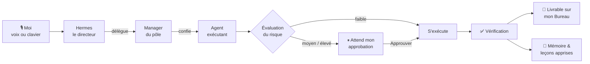
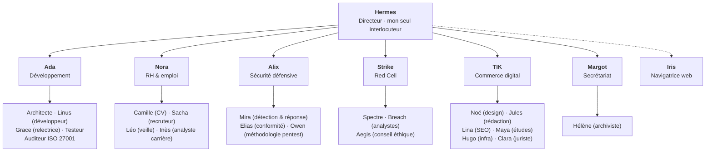

<a href="README.md">English</a> · <b>Français</b>

# OS-Agentique

**Une équipe personnelle d'agents IA qui tourne sur mon propre PC, me parle à la voix, et n'agit jamais sans mon accord.**

OS-Agentique transforme un poste Windows 11 en une petite entreprise d'agents IA bien organisée. Je parle à un seul directeur, *Hermes*. Il comprend la demande, confie le travail au bon service, et toute action sensible attend mon clic sur **Approuver**. Rien n'est considéré comme terminé tant que ce n'est pas vérifié.

> Ce dépôt est une **vitrine**. Le code source est dans un dépôt privé ; cette page montre ce que fait le système, comment je l'ai conçu et pourquoi.

---

## En bref

| | |
|---|---|
| **30 agents** répartis en **6 pôles** | Développement · RH & emploi · Sécurité défensive · Red Cell · Commerce digital · Secrétariat (+ un atelier Coworking partagé) |
| **Un noyau qui tient l'équipe** | tout ce qui s'exécute démarre par un noyau nommé qui vérifie l'identité de l'appelant, délivre des **jetons de capacité** recontrôlés à chaque appel d'outil, et peut tout arrêter jusqu'au niveau d'un seul outil |
| **Le cerveau de son choix** | changement en un clic : un modèle local de 25 milliards de paramètres sur ma propre carte graphique (RTX 4080, **0 $** par requête) ou Claude (Opus 5.5, Sonnet 5, Haiku 4.5…) quand une tâche demande plus de puissance |
| **Interface vocale** | mot d'activation « Hermès, … », reconnaissance et synthèse vocales locales, ~5 s par échange simple |
| **L'humain décide** | toute action à risque moyen ou élevé attend mon approbation ; une action à risque élevé vérifie ma présence par **Windows Hello** |
| **1 296 tests unitaires au vert** (0 échec, exécutés le jour de cette mise à jour) | + des tests de contrat sur chaque outil externe et des tests Pester sur l'installation PowerShell |
| **98 décisions de conception écrites** (ADR) | chacune consigne le contexte, le choix, les alternatives écartées et la preuve |
| **Construction toujours en cours** | développement actif : de nouvelles capacités sont ajoutées régulièrement |

---

## L'idée

Les agents IA savent désormais lire des fichiers, écrire du code, naviguer sur le web et lancer des commandes. C'est ce qui les rend utiles, et c'est aussi ce qui les rend risqués. Les outils devenus populaires en 2026 *confient souvent vos clés à l'agent* et comptent sur sa bonne conduite.

Je voulais l'inverse : **une équipe digne de confiance parce qu'elle est organisée comme une vraie entreprise.**

- **Un seul interlocuteur.** Je ne parle qu'au directeur. Il décide et délègue ; il ne touche jamais à rien lui-même.
- **Un organigramme clair.** Les managers planifient, seuls certains exécutants ont le droit d'écrire.
- **Des règles avant le pouvoir.** Chaque tâche reçoit un niveau de risque ; tout ce qui peut modifier quelque chose m'attend.
- **Des preuves, pas des promesses.** *« L'IA dit que c'est fait »* n'est jamais une preuve : le résultat est vérifié avant que la tâche soit close.
- **Une mémoire durable.** L'équipe tient un journal et apprend de ce qui l'a bloquée, quel que soit le modèle d'IA utilisé.
- **Privé par construction.** Le cerveau peut tourner entièrement sur mon PC ; mes données personnelles (mon CV, par exemple) ne sont traitées que par le modèle local ou par Claude, et sont techniquement empêchées d'arriver sur GitHub.

➡️ Toute l'histoire de sa conception : [**Conception & architecture**](docs/fr/conception.md)

---

## Comment ça marche, en une image

| Demander | Approuver |
|---|---|
|  |  |

---

## L'équipe

> La carte vivante, telle que Hermes la lit avant chaque décision : **30 agents**, leur pôle, leur rôle et le badge « écrit » pour les rares exécutants autorisés à modifier des fichiers.

| Pôle | Ce qu'il fait pour moi |
|---|---|
| **Développement** — Ada | conçoit, écrit, relit et teste du code ; peut confier des travaux à Claude Code ou Cursor, toujours sous approbation |
| **RH & emploi** — Nora | trouve et trie les offres (sources réelles : JobSpy, France Travail), transforme une annonce en CV adapté **relu avant livraison**, prépare lettres de motivation et entretiens |
| **Sécurité défensive** — Alix | règles de détection, analyse d'incidents, conformité ISO 27001, méthodologie et rapports de pentest, le tout adossé à un **SOC local** (voir plus bas) |
| **Red Cell** — Strike | émulation d'adversaire à visée défensive. Toute tâche de ce pôle est **forcée au niveau de risque maximal** : toujours une approbation manuelle, jamais d'automatique, avec un **conseiller éthique** intégré (Aegis) qui vérifie autorisation, périmètre et légalité |
| **Commerce digital** — TIK | un pôle produit complet (design, rédaction, SEO, études de marché, infra, juridique) pour construire et faire vivre un vrai site, derrière une frontière stricte « web ⊕ privilège » et des faits toujours sourcés |
| **Secrétariat** — Margot | tâches administratives récurrentes (factures, pièces), lecture locale uniquement, agrégats seulement |
| **Navigatrice web** — Iris | le **seul** agent qui pilote un navigateur, à la vue de l'opérateur, derrière un garde-fou déterministe |
| **Coworking** *(mode)* | un atelier partagé où l'équipe et moi travaillons ensemble sur un projet, avec un fil d'activité lisible et un journal infalsifiable |

➡️ Qui est chaque agent et ce qu'il fait : [**L'équipe**](docs/fr/equipe.md)

---

## Preuve de concept : le voir fonctionner

Tout ce qui suit a été capturé sur l'interface réelle, avec de vraies réponses du modèle d'IA.

| Chiffres rapides du panneau latéral | Carte du système |
|---|---|
|  |  |
| sessions, appels d'outils, jetons et coût lus dans la base du moteur, rien d'inventé | le directeur reçoit une carte réelle de son équipe et de ses outils avant chaque décision |

 <i>Adaptatif : la même interface sur téléphone. Ici l'action a été refusée, rien n'a été exécuté.</i>

➡️ Le parcours complet, étape par étape : [**Une journée avec Hermes**](docs/fr/parcours.md)

---

## Profilage en direct : voir ce que fait chaque agent

Diriger une équipe, c'est savoir qui travaille, sur quoi, combien de temps et pour quel coût. OS-Agentique dispose d'une **console de profilage** plein écran qui répond à ces questions pour chaque agent. Les chiffres sont lus dans les propres journaux du moteur, pas estimés par une IA.

**La semaine d'un coup d'œil :** demandes, temps typique d'un échange, jetons, coût réel, appels d'outils, approbations et alertes de dérive.

**Qui a travaillé quand :** une ligne par agent sur les dernières 24 heures. Bleu : une tâche lancée depuis l'interface ; gris : une session lancée hors de l'interface (sous-agent, ligne de commande) ; rouge : un échec.

**Par agent :** nombre de demandes, échecs, temps de travail, temps de réflexion du modèle, appels d'outils, jetons, coût et outils favoris. Un clic sur un agent filtre toutes les vues.

**Par outil :** chaque outil et serveur MCP utilisé, combien de fois, en combien de temps, et par quels agents. On voit d'un coup d'œil quel agent touche aux fichiers, au terminal ou au web.

> **Pourquoi c'est important :** l'observabilité transforme une boîte noire en une équipe qu'on peut diriger. Elle montre ce qui ralentit le système, ce qui coûte, et si un agent sort de son rôle.

---

## Suivi en direct : voir chaque agent travailler, au moment où il travaille

Le profilage me dit ce qui s'est passé. Le **suivi en direct** me montre ce qui se passe *maintenant*, même quand plusieurs tâches tournent en parallèle. L'objectif : ne jamais perdre le visuel sur l'équipe, et repérer une dérive avant qu'elle ne pose problème.

**Qui travaille, sur quoi, depuis quand.** Rafraîchi toutes les 3 secondes. Ici, trois agents travaillent en même temps : l'Architecte conçoit une application, Mira analyse une attaque par force brute, Léo fait une veille sur le web. Chacun affiche sa tâche et depuis combien de temps il y travaille ; un clic ouvre le détail.

**Chaque étape, au moment où elle se produit.** Dans la conversation, chaque action réelle s'affiche en direct : l'outil utilisé, sa durée, le début de ce qu'il a renvoyé, et l'agent à qui une tâche est déléguée.

**Des alertes de dérive automatiques.** Des règles fixes, pas une IA, surveillent chaque tâche en cours et donnent l'alerte quand quelque chose sort du cadre : une tentative d'écriture pendant une tâche en lecture seule, une délégation vers un pôle sensible, une boucle, des échecs répétés.

> **Pourquoi c'est important :** quand plusieurs agents travaillent en même temps, le contrôle n'existe que si l'on *voit*. Le suivi en direct garde un œil humain sur toute l'équipe.

---

## Changer de cerveau, garder l'équipe

Hermes reste le même ; seul le cerveau derrière lui change. Depuis l'onglet **Systèmes**, je fais passer toute l'équipe d'un modèle local, sur ma carte graphique, à Claude, et inversement, en une quinzaine de secondes. La conversation continue sans perdre son historique.

- **En local** quand je veux la confidentialité et le coût zéro ; **Claude Opus 5.5** pour un travail exigeant ; **Haiku** quand la rapidité compte plus que la profondeur.
- **Certains agents gardent un cerveau fixe**, quel que soit celui de l'équipe : le directeur et une partie de l'équipe de développement (Ada, Linus, l'Architecte) tournent sur Claude Sonnet 5, et la **Red Cell reste toujours en local**.
- **Des garde-fous inclus :** seuls des modèles d'une liste stricte et testée peuvent être choisis (aucune saisie libre), et les agents RH qui manipulent mes données personnelles refusent tout fournisseur autre que le modèle local ou Claude.

> **Pourquoi c'est important :** le bon outil pour chaque travail. Puissance, rapidité, coût et confidentialité deviennent un choix, pas une contrainte.

---

## Sous le capot : un noyau pour les agents

Au début, l'interface était la sécurité. Désormais, la sécurité est **dans le noyau**. Tout ce qui s'exécute — un tour de conversation, une tâche, un sous-agent, un script planifié — démarre par un **noyau nommé**, un ordonnanceur unique qui partage son état entre les processus. Plus rien ne tourne « à côté ».

- **Identité de l'appelant.** Chaque tour sait *qui* le demande. Le directeur lui-même parle au noyau en son nom ; rien n'agit de façon anonyme.
- **Jetons de capacité.** Le noyau accorde à un tour un jeu précis de droits (quels outils, quel périmètre), et ce jeton est **revérifié à chaque appel d'outil** — pas seulement au départ. Un agent ne peut pas élargir son pouvoir en cours de route.
- **Arrêt jusqu'au niveau de l'outil.** L'arrêt d'urgence ne coupe pas seulement une tâche : il s'applique au niveau d'un outil précis, sur tous les profils, et la garde du navigateur l'applique elle-même.
- **Processus enfants bornés.** Quand un agent lance Claude Code, Cursor ou un shell, l'enfant n'hérite d'**aucun nom de secret**, ses sorties sont bornées, et il est réellement interruptible.
- **Un journal unique, chaîné et signé.** Chaque événement est inscrit dans un journal chaîné par empreintes et signé : toute falsification se voit.

> **Pourquoi c'est important :** une règle de sécurité ne vaut que si le système l'impose lui-même. Déplacer la frontière de l'écran vers le noyau, c'est passer d'une politesse à une garantie.

---

## Un SOC local pour la sécurité défensive

Le pôle sécurité défensive ne fait pas que donner des conseils : il s'appuie sur un **centre de supervision (SOC) qui tourne sur le poste**, adossé au noyau.

- **Télémétrie réelle** (dont Sysmon avec une configuration maison), normalisée, où chaque sortie réseau est rattachée à l'agent qui l'a provoquée.
- **Registre des sorties des agents** : on voit, et on classe, ce que chaque agent tente vers l'extérieur ; un pare-feu en apprentissage distingue le normal de l'anormal.
- **Broker à catalogue** : les actions privilégiées passent par une liste fermée, avec une **élévation UAC par action** — jamais un blanc-seing.
- **Audit chaîné, sceau, arrêt d'urgence et mode sûr** pour garder le contrôle même en cas d'incident.

> Présenté ici dans les grandes lignes : ce dépôt montre l'intention et les garde-fous, pas les détails opérationnels.

---

## Le Salon d'agents : l'équipe qui se parle

Une équipe n'est pas qu'un arbre de délégation. OS-Agentique a un **Salon** : un fil visible où les agents échangent entre eux, sur le cerveau **local** et dans un cadre borné par une politique.

> Capture réelle, sur une démo isolée (cerveau local gemma4-hermes). Au centre, les agents se répondent ; à droite, un **chantier proposé** (que j'ouvre, ou non, en espace Coworking) et les **leçons à retenir** : chaque note attend mon « Retenir » ou « Ne pas retenir ».

- Un agent peut **ouvrir un ticket**, en mentionner un autre, et le fil suit le chantier qu'il a fait naître.
- Les agents **proposent des notes de mémoire** ; rien n'est retenu sans ma validation (voir ci-dessous).
- Une **rétrospective hebdomadaire** se tient toute seule, et le salon peut **tenir des semaines sans surveillance** (répartiteur incassable, tickets inactifs clos, historique borné, signal de blocage).
- Un chantier proposé dans le salon ne s'ouvre en espace Coworking **que sur ma décision**.

> **Pourquoi c'est important :** c'est là qu'une « équipe » cesse d'être une métaphore. Le travail collectif devient lisible — et reste sous contrôle.

---

## La mémoire, mais sous validation

Les agents apprennent, mais ne décident pas seuls de ce qu'ils retiennent. Jarvis a une file **« Mémoires en attente »** : chaque note proposée m'est présentée pour **Valider** ou **Refuser**, et c'est Hermes Agent lui-même qui applique ma décision. Ce que l'opérateur demande de retenir **sur lui** s'écrit dans ses propres tours ; le reste attend mon feu vert.

---

## Un vrai pôle produit : le commerce digital (TIK)

Au-delà du code et de l'emploi, l'équipe sait porter un **projet commercial** de bout en bout. Le pôle TIK réunit design, rédaction, SEO, études de marché, infrastructure et juridique autour d'un site réel.

- **Frontière « web ⊕ privilège » :** un agent peut avoir le web **ou** un privilège sur le serveur, jamais les deux dans le même geste.
- **Des faits avec provenance :** rien n'est affirmé sans source ; les décisions s'appuient sur des faits datés et traçables.
- **Missions et budgets :** le travail est cadré par des objectifs et des plafonds (y compris un **plafond de publication**), avec une agente juriste pour le socle légal.
- **Passerelle hébergeur en lecture d'abord**, écritures ensuite, jeton au coffre.

---

## Ce qu'il sait faire

- **Converser.** Conversation vocale continue (« Hermès, stop » l'interrompt), ou au clavier.
- **Déléguer du vrai travail.** Code, documents, recherches : répartis entre les bons agents et suivis en direct à l'écran, étape par étape.
- **Construire un CV à partir d'une annonce.** Camille rédige, Sacha relit, la livraison n'a lieu que s'il ne reste aucun point bloquant. Une information manquante devient une question qu'il me pose, jamais une invention.
- **Chercher un emploi.** Veille quotidienne, tri, miroir dans Notion, relances. Le clic final « postuler » reste toujours le mien.
- **Appuyer le travail de sécurité.** Règles de détection, contrôles de conformité, méthodologie et rapports, adossés à un SOC local.
- **Porter un projet commercial.** Le pôle TIK conçoit, rédige, référence et cadre un vrai site, budgets et socle juridique compris.
- **Travailler en équipe, visiblement.** Le Salon laisse les agents se coordonner, ouvrir des tickets et tenir une rétro — sous mon contrôle.
- **Apprendre sous validation.** Les notes de mémoire me sont proposées ; je valide ou je refuse.
- **Se connaître.** Un bilan de santé (`doctor`), une carte vivante de l'équipe, un profilage de qui a fait quoi, quand et pour quel coût.
- **Se protéger.** Sauvegarde automatique toutes les heures, avec un détecteur de secrets qui bloque toute fuite.
- **Proposer des améliorations.** Il suggère les agents ou compétences qui lui manquent, sans jamais les activer seul.

---

## Technologies

| Couche | Technologie |
|---|---|
| Moteur d'agents | [Hermes Agent](https://github.com/NousResearch/hermes-agent) (Nous Research) : profils, skills, mémoire |
| Cerveau IA | au choix depuis l'interface : modèles locaux servis par Ollama (`gemma4-hermes` sur une RTX 4080) ou Claude (Opus 5.5, Fable 5.1, Sonnet 5, Haiku 4.5) par abonnement |
| Noyau | ordonnanceur unique, identité d'appelant, jetons de capacité, journal chaîné signé, arrêt au niveau de l'outil |
| Cœur d'orchestration | Node.js / TypeScript, **aucune dépendance à l'exécution** |
| Interface | React, TypeScript, Tailwind, Vite |
| Voix | Whisper (voix → texte) et Kokoro (texte → voix), 100 % local |
| Outils externes | serveurs MCP (dont CV Creator, passerelle « hermes-os »), avec un test de contrat par outil |
| SOC | télémétrie (dont Sysmon, config maison), broker à catalogue, élévation UAC par action |
| Exécuteurs de code | Claude Code, Cursor |
| Scripts | PowerShell 7 : installation reproductible en une commande (tests Pester) |

➡️ Les choix techniques dont je suis le plus fier : [**Décisions clés**](docs/fr/decisions.md)

---

## Sa place parmi les « OS agentiques »

| | Qui tient l'agent ? |
|---|---|
| OS agentique de recherche (ex. AIOS) | le système d'exploitation lui-même, repensé pour les agents |
| Windows 11 agentique | Windows : un compte et un espace séparés pour chaque agent |
| Assistants de bureau (OpenClaw, Manus…) | surtout la bonne conduite de l'agent |
| **OS-Agentique** | **des règles explicites, une politique de risque, la vérification et mon approbation** |

OS-Agentique est une **couche d'orchestration d'agents** : un « OS agentique » au sens où l'entend le monde de l'entreprise, qui tourne au-dessus de Windows. La prochaine étape est de faire tourner les agents qui écrivent sous un compte Windows dédié et restreint, pour que les règles soient aussi imposées par le système d'exploitation.

---

<i>Conçu et réalisé par <a href="https://github.com/Dow08"><b>Dow08</b></a></i>

