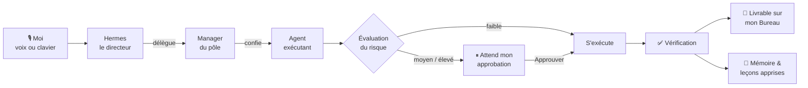
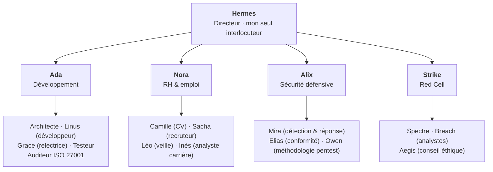

<a href="README.md">English</a> · <b>Français</b>

# OS-Agentique

**Une équipe personnelle d'agents IA qui tourne sur mon propre PC, me parle à la voix, et n'agit jamais sans mon accord.**

OS-Agentique transforme un poste Windows 11 en une petite entreprise d'agents IA bien organisée. Je parle à un seul directeur, *Hermes*. Il comprend la demande, confie le travail au bon service, et toute action sensible attend mon clic sur **Approuver**. Rien n'est considéré comme terminé tant que ce n'est pas vérifié.

> Ce dépôt est une **vitrine**. Le code source est dans un dépôt privé ; cette page montre ce que fait le système, comment je l'ai conçu et pourquoi.

---

## En bref

| | |
|---|---|
| **20 agents** répartis en **5 pôles** | Développement · RH & emploi · Sécurité défensive · Red Cell · Coworking |
| **Cerveau IA 100 % local** | un modèle de 25 milliards de paramètres sur ma propre carte graphique (RTX 4080) : **0 $** par requête sur le cerveau local ; le cloud n'est qu'un repli explicite et encadré (0,32 $ sur la dernière semaine) |
| **Interface vocale** | mot d'activation « Hermès, … », reconnaissance et synthèse vocales locales, ~5 s par échange simple |
| **L'humain décide** | toute action à risque moyen ou élevé attend mon approbation |
| **607 tests automatisés**, tous au vert | + des tests de contrat sur chaque outil externe utilisé |
| **55 décisions de conception écrites** (ADR) | chacune consigne le contexte, le choix, les alternatives écartées et la preuve |
| **Construction toujours en cours** | développement actif : de nouvelles capacités sont ajoutées régulièrement |

---

## L'idée

Les agents IA savent désormais lire des fichiers, écrire du code, naviguer sur le web et lancer des commandes. C'est ce qui les rend utiles, et c'est aussi ce qui les rend risqués. Les outils devenus populaires en 2026 *confient souvent vos clés à l'agent* et comptent sur sa bonne conduite.

Je voulais l'inverse : **une équipe digne de confiance parce qu'elle est organisée comme une vraie entreprise.**

- **Un seul interlocuteur.** Je ne parle qu'au directeur. Il décide et délègue ; il ne touche jamais à rien lui-même.
- **Un organigramme clair.** Les managers planifient, seuls certains exécutants ont le droit d'écrire.
- **Des règles avant le pouvoir.** Chaque tâche reçoit un niveau de risque ; tout ce qui peut modifier quelque chose m'attend.
- **Des preuves, pas des promesses.** *« L'IA dit que c'est fait »* n'est jamais une preuve : le résultat est vérifié avant que la tâche soit close.
- **Une mémoire durable.** L'équipe tient un journal et apprend de ce qui l'a bloquée, quel que soit le modèle d'IA utilisé.
- **Privé par construction.** Le cerveau tourne en local ; les données personnelles (mon CV, par exemple) sont techniquement empêchées d'arriver sur GitHub.

➡️ Toute l'histoire de sa conception : [**Conception & architecture**](docs/fr/conception.md)

---

## Comment ça marche, en une image

| Demander | Approuver |
|---|---|
|  |  |

---

## L'équipe

| Pôle | Ce qu'il fait pour moi |
|---|---|
| **Développement** — Ada | conçoit, écrit, relit et teste du code ; peut confier des travaux à Claude Code ou Cursor, toujours sous approbation |
| **RH & emploi** — Nora | trouve et trie les offres, transforme une annonce en CV adapté **relu avant livraison**, prépare lettres de motivation et entretiens |
| **Sécurité défensive** — Alix | règles de détection, analyse d'incidents, conformité ISO 27001, méthodologie et rapports de pentest, appuyés sur une bibliothèque de 759 guides défensifs |
| **Red Cell** — Strike | émulation d'adversaire à visée défensive. Toute tâche de ce pôle est **forcée au niveau de risque maximal** : toujours une approbation manuelle, jamais d'automatique, avec un **conseiller éthique** intégré (Aegis) qui vérifie autorisation, périmètre et légalité |
| **Coworking** | un atelier partagé où l'équipe et moi travaillons ensemble sur un projet, avec un fil d'activité lisible et un journal infalsifiable |

➡️ Qui est chaque agent et ce qu'il fait : [**L'équipe**](docs/fr/equipe.md)

---

## Preuve de concept : le voir fonctionner

Tout ce qui suit a été capturé sur l'interface réelle, avec de vraies réponses du modèle local.

| Chiffres rapides du panneau latéral | Carte du système |
|---|---|
|  |  |
| sessions, appels d'outils, jetons et coût lus dans la base du moteur, rien d'inventé | le directeur reçoit une carte réelle de son équipe et de ses outils avant chaque décision |

 <i>Adaptatif : la même interface sur téléphone. Ici l'action a été refusée, rien n'a été exécuté.</i>

➡️ Le parcours complet, étape par étape : [**Une journée avec Hermes**](docs/fr/parcours.md)

---

## Profilage en direct : voir ce que fait chaque agent

Diriger une équipe, c'est savoir qui travaille, sur quoi, combien de temps et pour quel coût. OS-Agentique dispose d'une **console de profilage** plein écran qui répond à ces questions pour chaque agent. Les chiffres sont lus dans les propres journaux du moteur, pas estimés par une IA.

**La semaine d'un coup d'œil :** demandes, temps typique d'un échange, jetons, coût réel, appels d'outils, approbations et alertes de dérive.

**Qui a travaillé quand :** une ligne par agent sur les dernières 24 heures. Bleu : une tâche lancée depuis l'interface ; gris : une session lancée hors de l'interface (sous-agent, ligne de commande) ; rouge : un échec.

**Par agent :** nombre de demandes, échecs, temps de travail, temps de réflexion du modèle, appels d'outils, jetons, coût et outils favoris. Un clic sur un agent filtre toutes les vues.

**Par outil :** chaque outil et serveur MCP utilisé, combien de fois, en combien de temps, et par quels agents. On voit d'un coup d'œil quel agent touche aux fichiers, au terminal ou au web.

> **Pourquoi c'est important :** l'observabilité transforme une boîte noire en une équipe qu'on peut diriger. Elle montre ce qui ralentit le système, ce qui coûte, et si un agent sort de son rôle.

---

## Ce qu'il sait faire

- **Converser.** Conversation vocale continue (« Hermès, stop » l'interrompt), ou au clavier.
- **Déléguer du vrai travail.** Code, documents, recherches : répartis entre les bons agents et suivis en direct à l'écran, étape par étape.
- **Construire un CV à partir d'une annonce.** Camille rédige, Sacha relit, la livraison n'a lieu que s'il ne reste aucun point bloquant. Une information manquante devient une question qu'il me pose, jamais une invention.
- **Chercher un emploi.** Veille quotidienne, tri, miroir dans Notion, relances. Le clic final « postuler » reste toujours le mien.
- **Appuyer le travail de sécurité.** Règles de détection, contrôles de conformité, méthodologie et rapports.
- **Se connaître.** Un bilan de santé (`doctor`), une carte vivante de l'équipe, un profilage de qui a fait quoi, quand et pour quel coût.
- **Se protéger.** Sauvegarde automatique toutes les heures, avec un détecteur de secrets qui bloque toute fuite.
- **Proposer des améliorations.** Il suggère les agents ou compétences qui lui manquent, sans jamais les activer seul.

---

## Technologies

| Couche | Technologie |
|---|---|
| Moteur d'agents | [Hermes Agent](https://github.com/NousResearch/hermes-agent) (Nous Research) : profils, skills, mémoire |
| Cerveau IA | `gemma4-hermes`, un modèle local servi par Ollama sur une RTX 4080 ; repli cloud sur le portable |
| Cœur d'orchestration | Node.js / TypeScript, **aucune dépendance à l'exécution** |
| Interface | React, TypeScript, Tailwind, Vite |
| Voix | Whisper (voix → texte) et Kokoro (texte → voix), 100 % local |
| Exécuteurs de code | Claude Code, Cursor |
| Scripts | PowerShell 7 : installation reproductible en une commande |

➡️ Les choix techniques dont je suis le plus fier : [**Décisions clés**](docs/fr/decisions.md)

---

## Sa place parmi les « OS agentiques »

| | Qui tient l'agent ? |
|---|---|
| OS agentique de recherche (ex. AIOS) | le système d'exploitation lui-même, repensé pour les agents |
| Windows 11 agentique | Windows : un compte et un espace séparés pour chaque agent |
| Assistants de bureau (OpenClaw, Manus…) | surtout la bonne conduite de l'agent |
| **OS-Agentique** | **des règles explicites, une politique de risque, la vérification et mon approbation** |

OS-Agentique est une **couche d'orchestration d'agents** : un « OS agentique » au sens où l'entend le monde de l'entreprise, qui tourne au-dessus de Windows. La prochaine étape est de faire tourner les agents qui écrivent sous un compte Windows dédié et restreint, pour que les règles soient aussi imposées par le système d'exploitation.

---

<i>Conçu et réalisé par <a href="https://github.com/Dow08"><b>Dow08</b></a></i>

