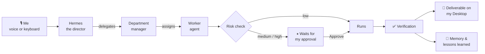
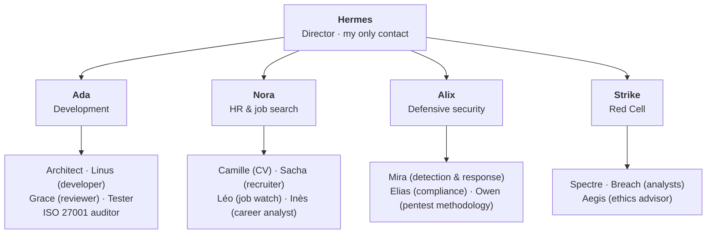

<b>English</b> · <a href="README.fr.md">Français</a>

# OS-Agentique

**A personal team of AI agents that runs on my own PC, talks with me by voice, and never acts without my approval.**

OS-Agentique turns a Windows 11 workstation into a small, well-run company of AI agents. I talk to one director, *Hermes*. He understands the request, hands the work to the right department, and every sensitive action waits for my click on **Approve**. Nothing counts as done until it has been checked.

> This repository is a **showcase**. The source code lives in a private repository; this page shows what the system does, how I designed it and why.

---

## At a glance

| | |
|---|---|
| **20 agents** in **5 departments** | Development · HR & job search · Defensive security · Red Cell · Coworking |
| **Brain of your choice** | switch in one click: a 25-billion-parameter local model on my own GPU (RTX 4080, **0 $** per request) or Claude (Opus 5.5, Sonnet 5, Haiku 4.5…) when a task needs more power |
| **Voice interface** | wake word “Hermès, …”, local speech recognition and synthesis, ~5 s per simple turn |
| **Human in the loop** | every medium- or high-risk action waits for my approval |
| **607 automated tests**, all passing | + contract tests on every external tool it depends on |
| **55 written design decisions** (ADRs) | each one records the context, the choice, the rejected alternatives and the evidence |
| **Work in progress** | actively developed: new capabilities are added regularly |

---

## The idea

AI agents can now read files, write code, browse the web and run commands. That makes them useful, and it makes them risky. The tools that became popular in 2026 mostly *hand the agent your keys* and rely on its good behaviour.

I wanted the opposite: **a team I can trust because it is organised like a real company.**

- **One point of contact.** I only speak to the director. He decides and delegates; he never touches anything himself.
- **A clear org chart.** Managers plan, only designated workers are allowed to write.
- **Rules before power.** Every task is scored for risk; anything that can change something waits for me.
- **Proof, not promises.** *“The AI says it’s done”* is never accepted as proof: results are verified before a task is marked complete.
- **Memory that lasts.** The team keeps a journal and learns from what blocked it, independently of the AI model in use.
- **Private by design.** The brain can run entirely on my PC; my personal data (my CV, for example) is only ever handled by the local model or Claude, and is technically prevented from reaching GitHub.

➡️ The full story of how I designed it: [**Design & architecture**](docs/en/design.md)

---

## How it works, in one picture

| Asking | Approving |
|---|---|
|  |  |

---

## The team

| Department | What it does for me |
|---|---|
| **Development** — Ada | designs, writes, reviews and tests code; can hand coding jobs to Claude Code or Cursor, always under approval |
| **HR & job search** — Nora | finds and sorts job offers, turns a job ad into a tailored CV that is **reviewed before delivery**, drafts cover letters and interview prep |
| **Defensive security** — Alix | detection rules, incident analysis, ISO 27001 compliance, pentest methodology and reports, backed by a library of 759 defensive guides |
| **Red Cell** — Strike | adversary emulation for defensive purposes. Every task in this department is **forced to the highest risk level**: always a manual approval, never automatic, with a built-in **ethics advisor** (Aegis) who checks authorisation, scope and legality |
| **Coworking** | a shared workspace where the team and I work on a project together, with a readable activity feed and a tamper-evident log |

➡️ Who each agent is and what it does: [**Meet the team**](docs/en/team.md)

---

## Proof of concept: see it working

Everything below was captured on the real interface, with real answers from the AI model.

| Quick stats in the side panel | Self-knowledge map |
|---|---|
|  |  |
| sessions, tool calls, tokens and cost read from the engine's own database, nothing invented | the director is given a real map of his team and tools before every decision |

 <i>Responsive: the same interface on a phone. Here the action was refused, so nothing ran.</i>

➡️ A full step-by-step walkthrough: [**A day with Hermes**](docs/en/walkthrough.md)

---

## Live profiling: see what every agent does

Managing a team means knowing who is working, on what, for how long and at what cost. OS-Agentique has a full-screen **profiling console** that answers those questions for every agent. The figures are read from the engine's own records, not estimated by an AI.

**The week at a glance:** requests, typical turn time, tokens, real cost, tool calls, approvals and drift alerts.

**Who worked when:** one line per agent over the last 24 hours. Blue: a task started from the interface; grey: a session run outside the interface (sub-agent, command line); red: a failure.

**Per agent:** number of requests, failures, working time, model thinking time, tool calls, tokens, cost and favourite tools. Clicking an agent filters every view.

**Per tool:** every tool and MCP server used, how often, how fast, and by which agents. That shows at a glance which agent touches the file system, the terminal or the web.

> **Why it matters:** observability is what turns a black box into a team you can manage. It shows what slows the system down, what costs money, and whether an agent is stepping outside its role.
>
> *The interface is in French: I designed it for my own daily use.*

---

## Live tracking: see every agent at work, as it happens

Profiling tells me what happened. **Live tracking** shows me what is happening *right now*, even when several tasks run in parallel. The goal: never lose sight of the team, and spot a drift before it becomes a problem.

**Who is working, on what, since when.** Refreshed every 3 seconds. Here, three agents work at the same time: the Architect designs an application, Mira analyses a brute-force attack, Léo runs a web watch. Each one shows its task and how long it has been running, and a click opens the detail.

**Every step, as it happens.** In the conversation, each real action appears live: the tool used, how long it took, the start of what it returned, and the agent a task is delegated to.

**Automatic drift alerts.** Deterministic rules, not an AI, watch every running task and raise an alert when something leaves its frame: an attempt to write during a read-only task, a delegation to a sensitive department, a loop, repeated failures.

> **Why it matters:** with several agents working at once, control only exists if you can *see*. Live tracking keeps a human eye on the whole team.

---

## Choose the brain, keep the team

Hermes stays the same; only the brain behind him changes. From the **Systems** tab, I switch the whole team from a local model running on my GPU to Claude, and back, in about fifteen seconds. The conversation continues without losing its history.

- **Local** when I want privacy and zero cost; **Claude Opus 5.5** for demanding work; **Haiku** when speed matters more than depth.
- **Some agents keep a fixed brain**, whatever the team uses: the director and part of the development team (Ada, Linus, the Architect) run on Claude Sonnet 5, and the **Red Cell always stays local**.
- **Guard-rails included:** only models from a strict, tested list can be chosen (no free input), and the HR agents that handle my personal data refuse any provider other than the local model or Claude.

> **Why it matters:** the right tool for each job. Power, speed, cost and privacy become a choice, not a constraint.

---

## What it can do

- **Talk.** Continuous voice conversation (“Hermès, stop” interrupts him), or typing.
- **Delegate real work.** Code, documents, research: split across the right agents, followed live on screen step by step.
- **Build a CV from a job ad.** Camille writes, Sacha reviews, delivery happens only if no blocking issue remains. Missing information becomes a question to me, never an invention.
- **Hunt for jobs.** Daily watch, sorting, a Notion mirror, follow-ups. The final “apply” click is always mine.
- **Support security work.** Detection rules, compliance checks, methodology and reports.
- **Know itself.** A health check (`doctor`), a live map of the team, profiling of who did what, when and at what cost.
- **Protect itself.** Automatic hourly backups with a secret scanner that blocks any leak.
- **Propose improvements.** It suggests the agents or skills it lacks, but never activates them on its own.

---

## Built with

| Layer | Technology |
|---|---|
| Agent engine | [Hermes Agent](https://github.com/NousResearch/hermes-agent) (Nous Research): profiles, skills, memory |
| AI brain | switchable from the interface: local models served by Ollama (`gemma4-hermes` on an RTX 4080) or Claude (Opus 5.5, Fable 5.1, Sonnet 5, Haiku 4.5) through a subscription |
| Orchestration core | Node.js / TypeScript, **zero runtime dependency** |
| Interface | React, TypeScript, Tailwind, Vite |
| Voice | Whisper (speech-to-text) and Kokoro (text-to-speech), 100 % local |
| Coding executors | Claude Code, Cursor |
| Scripts | PowerShell 7: one-command, repeatable install |

➡️ The engineering choices I am most proud of: [**Key decisions**](docs/en/decisions.md)

---

## Where it sits among “agentic OS” projects

| | Who keeps the agent in check? |
|---|---|
| Research agentic OS (e.g. AIOS) | the operating system itself, rebuilt for agents |
| Windows 11 agentic features | Windows: a separate account and workspace for each agent |
| Desktop assistants (OpenClaw, Manus…) | mostly the agent’s own good behaviour |
| **OS-Agentique** | **explicit rules, a risk policy, verification, and my approval** |

OS-Agentique is an **agent orchestration layer**: an “agentic OS” in the business sense, running on top of Windows. The next milestone is to run the agents that write files under a dedicated, restricted Windows account, so that the rules are also enforced by the operating system.

---

<i>Designed and built by <a href="https://github.com/Dow08"><b>Dow08</b></a></i>

