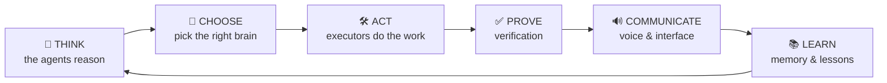
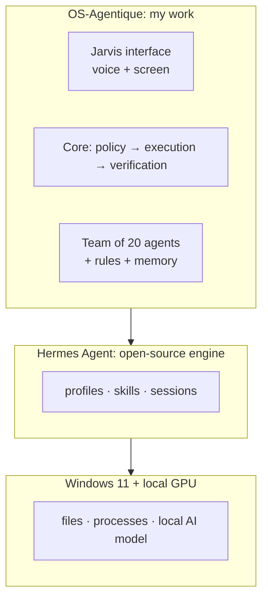
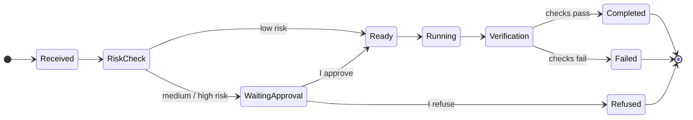

<b>English</b> · <a href="../fr/conception.md">Français</a> · <a href="../../README.md">← Back</a>

# Design & architecture

How I thought about OS-Agentique, and how it works, without going too deep into the code.

## 1. The problem I wanted to solve

I wanted AI agents that do real work on my machine: write code, prepare documents, look for jobs, support security work. But I did not want to *hope* they behave. I wanted to **know**, the way a manager knows what their team is doing.

That gave me three questions, and the whole system answers them:

1. **Who decides?** One director talks to me; departments do the work.
2. **What is allowed?** Every task gets a risk level; anything that can change something waits for me.
3. **How do I know it worked?** Results are checked, not assumed.

## 2. Six verbs

Early on, I organised the whole system around six verbs. Every component has exactly one job:

## 3. Three layers: do not rebuild what already exists

A key decision on day 2: instead of writing my own agent engine, I built **around** an existing open-source one, [Hermes Agent](https://github.com/NousResearch/hermes-agent). My work is the layer that turns a single agent into an organised, supervised team.

## 4. The life of a task

Every request, whether it comes from voice, keyboard or another agent, goes through **one single door**. There is no shortcut.

Three rules I never break:

- **The risk can only go up.** The risk of a task is the highest of what was requested and what the task can *actually* do. Nobody, not even an agent, can declare a dangerous task “low risk” to skip my approval.
- **An approval is tied to what I saw.** When I click “Approve”, I approve *that exact action*. If anything changes after my click, it is rejected.
- **“Done” needs proof.** The system checks that the file exists, the command succeeded and nothing leaked, before marking a task complete.

## 5. Security in layers

I come from cybersecurity, so the system is designed like a defended network: several independent barriers, so that one failure is not enough.

| Barrier | What it stops |
|---|---|
| **Org chart** | only designated workers can write; managers and the director can only read and delegate |
| **Risk policy + approval** | nothing that can change something runs without my click |
| **Access matrix** | my personal data (CV) is reachable only by the HR department; a security agent guards it |
| **No web + personal data together** | an agent that browses the web never holds my personal data in the same turn, so a malicious web page cannot make it leak |
| **Drift alerts** | automatic alerts if a task leaves its scope while running |
| **Secret scanner** | every backup is scanned; any password or key blocks the commit |
| **Local only** | the interface listens on the PC only, never on the network |

## 6. How I work: decisions written down, proof required

- **55 decision records (ADRs).** Each one states the context, the decision, the rejected alternatives and the *evidence*. When something is decided, it is written, so the next session (human or AI) does not undo it.
- **A gate before every feature**: *What? Why? Interface? Security? Test? Rollback?*, answered **before** writing code.
- **607 automated tests**, plus *contract tests* that check every external tool still behaves as expected after an update.
- **Deterministic first.** Whatever is mechanical is done by a plain script, not by an AI. AI is kept for what really needs judgement.
- **Reproducible.** One PowerShell command rebuilds the whole environment on a fresh PC.

## 7. What I learned along the way

Honest lessons that shaped the design:

- **AI can announce work without doing it.** Hermes once answered “I'm launching a search…” and called no tool at all. Since then, the interface shows every real step live, and says explicitly when an action was only *announced*.
- **Written rules are not enforced rules.** A cross-audit showed that my risk rule existed in the documentation but was not applied in one code path. I fixed it, and I wrote down the principle: a rule counts only if a test proves it.
- **A good model is not always the biggest one.** I benchmarked several local models on agent tasks. The one I kept scored 9/10 and answers a simple exchange in about 5 seconds on my GPU.

---

Next: [**Meet the team**](team.md) · [**A day with Hermes**](walkthrough.md) · [**Key decisions**](decisions.md)
