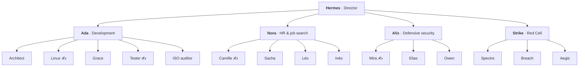

<b>English</b> · <a href="../fr/equipe.md">Français</a> · <a href="../../README.md">← Back</a>

# Meet the team

20 agents, organised like a company. Each agent has an identity card (its “soul”) that sets its mission, its rules and whether it is allowed to write.

**The golden rule:** managers read, decide and delegate. Only designated workers (marked ✍️) are allowed to write, and even then only within the limits of an approved task.

---

## 🎯 Hermes, the director

My **only point of contact**. He listens (voice or keyboard), decides what needs doing, hands it to the right department and reports back. He never does the work himself, and he can only *read*: that keeps the most exposed agent, the one I talk to, also the least powerful.

---

## 💻 Development: Ada

| Agent | Role |
|---|---|
| **Ada** (manager) | turns a feature request into a plan and checks the result is complete and tested |
| **Architect** | designs the technical approach *before* anyone writes code |
| **Linus** ✍️ | writes and fixes the code; says exactly which files he touched |
| **Grace** | reviews changes: bugs, security flaws, missing tests, each ranked by severity. Never modifies anything |
| **Tester** ✍️ | runs the test suites and reports, without “fixing” anything to make them pass |
| **ISO auditor** | checks the project against the ISO 27001 security standard |

*The Architect, the Tester and the ISO auditor were designed by the system's own “agent factory”, then tested and approved by me before being activated.*

---

## 👥 HR & job search: Nora

| Agent | Role |
|---|---|
| **Nora** (manager) | runs the job search and CV work; when information is missing, she **asks me** instead of inventing it |
| **Léo** | watches public job boards every morning. He only knows the search criteria, **never** my personal data |
| **Inès** | scores each offer against my profile and discusses it with me. She reads my profile but has **no web access** |
| **Camille** ✍️ | analyses a job ad and writes a CV tailored to it, from real facts only |
| **Sacha** | reads the CV like a recruiter would: “does it pass the first screening, and why?” |

*The split between Léo (web, no personal data) and Inès (personal data, no web) is deliberate: a malicious job ad can never trick an agent into leaking my information.*

---

## 🛡️ Defensive security: Alix

| Agent | Role |
|---|---|
| **Alix** (manager) | plans security work and **guards access** to my personal data across the whole system |
| **Mira** ✍️ | detection and incident response: analyses logs and alerts, writes detection rules and reports |
| **Elias** | compliance audits, read-only: ISO 27001, NIST, GDPR |
| **Owen** | prepares and documents penetration tests carried out by me: scope, rules of engagement, checklists, report templates |

*The department relies on a local library of 759 defensive guides (detection, forensics, incident response, hardening, compliance).*

---

## 🔴 Red Cell: Strike

Adversary emulation, **for defensive purposes**, under strict supervision.

| Agent | Role |
|---|---|
| **Strike** (manager) | leads the cell and plans authorised engagements |
| **Spectre** · **Breach** | analysts supporting authorised security assessments |
| **Aegis** | **ethics advisor**: reviews every plan for authorisation, scope, legality, proportionality and data protection. Advises only, never acts |

**Built-in safeguards:**
- every task in this department is **forced to the highest risk level**, whatever the request;
- it therefore **always waits for my manual approval**; the “Auto” mode can never approve it;
- a real action is always a gesture I perform myself, on a target I am authorised to test.

---

## 🤝 Coworking

Not an agent but a **shared workspace**: I set a goal, the team works on it, and I follow a readable activity feed, answer questions and approve steps. Its log is chained with fingerprints, so any tampering is detected.

---

Next: [**A day with Hermes**](walkthrough.md) · [**Design & architecture**](design.md) · [**Key decisions**](decisions.md)
