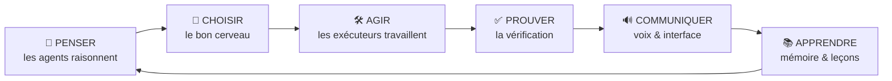
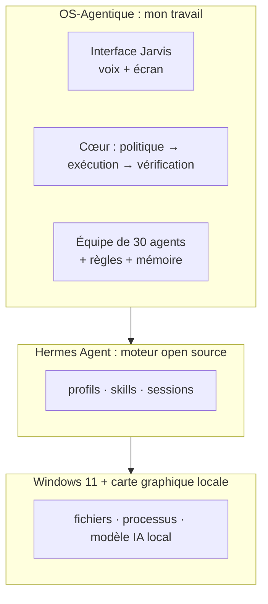
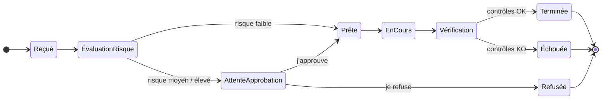

<a href="../en/design.md">English</a> · <b>Français</b> · <a href="../../README.fr.md">← Retour</a>

# Conception & architecture

Comment j'ai pensé OS-Agentique et comment il fonctionne, sans trop entrer dans le code.

## 1. Le problème que je voulais résoudre

Je voulais des agents IA qui font du vrai travail sur ma machine : écrire du code, préparer des documents, chercher un emploi, appuyer le travail de sécurité. Mais je ne voulais pas *espérer* qu'ils se comportent bien. Je voulais **savoir**, comme un manager sait ce que fait son équipe.

Cela m'a donné trois questions, et tout le système y répond :

1. **Qui décide ?** Un seul directeur me parle ; les pôles font le travail.
2. **Qu'est-ce qui est permis ?** Chaque tâche reçoit un niveau de risque ; tout ce qui peut modifier quelque chose m'attend.
3. **Comment je sais que ça a marché ?** Le résultat est vérifié, pas supposé.

## 2. Six verbes

Très tôt, j'ai organisé tout le système autour de six verbes. Chaque composant a exactement un rôle :

## 3. Trois étages : ne pas refaire ce qui existe déjà

Une décision clé, dès le deuxième jour : au lieu d'écrire mon propre moteur d'agents, j'ai construit **autour** d'un moteur open source existant, [Hermes Agent](https://github.com/NousResearch/hermes-agent). Mon travail, c'est la couche qui transforme un agent isolé en une équipe organisée et supervisée.

## 4. La vie d'une tâche

Chaque demande, qu'elle vienne de la voix, du clavier ou d'un autre agent, passe par **une seule porte**. Il n'y a pas de raccourci.

Trois règles que je ne transgresse jamais :

- **Le risque ne peut que monter.** Le risque d'une tâche est le plus élevé entre ce qui est demandé et ce que la tâche peut *réellement* faire. Personne, pas même un agent, ne peut déclarer « faible » une tâche dangereuse pour éviter mon approbation.
- **Une approbation est liée à ce que j'ai vu.** Quand je clique sur « Approuver », j'approuve *exactement cette action*. Si quoi que ce soit change après mon clic, elle est rejetée.
- **« Terminé » exige une preuve.** Le système vérifie que le fichier existe, que la commande a réussi et que rien n'a fuité, avant de clore la tâche.

## 5. Une sécurité en couches

Je viens de la cybersécurité : le système est donc conçu comme un réseau défendu, avec plusieurs barrières indépendantes, pour qu'une seule défaillance ne suffise pas.

| Barrière | Ce qu'elle empêche |
|---|---|
| **Organigramme** | seuls certains exécutants peuvent écrire ; managers et directeur lisent et délèguent |
| **Politique de risque + approbation** | rien de ce qui peut modifier quelque chose ne s'exécute sans mon clic |
| **Matrice des accès** | mes données personnelles (CV) ne sont accessibles qu'au pôle RH ; une agente sécurité en est la gardienne |
| **Jamais le web et mes données ensemble** | un agent qui navigue sur le web ne détient jamais mes données personnelles dans le même échange : une page piégée ne peut pas les faire sortir |
| **Alertes de dérive** | alertes automatiques si une tâche sort de son cadre pendant l'exécution |
| **Détecteur de secrets** | chaque sauvegarde est analysée ; un mot de passe ou une clé bloque le commit |
| **Local uniquement** | l'interface n'écoute que sur le PC, jamais sur le réseau |

## 6. Ma façon de travailler : décisions écrites, preuves exigées

- **98 décisions d'architecture (ADR).** Chacune précise le contexte, la décision, les alternatives écartées et la *preuve*. Ce qui est décidé est écrit, pour que la session suivante (humaine ou IA) ne le défasse pas.
- **Un sas avant chaque fonctionnalité** : *Quoi ? Pourquoi ? Interface ? Sécurité ? Test ? Retour arrière ?*, avec une réponse **avant** d'écrire le code.
- **1 296 tests unitaires au vert (0 échec)**, plus des *tests de contrat* qui vérifient que chaque outil externe se comporte toujours comme prévu après une mise à jour.
- **Le déterministe d'abord.** Ce qui est mécanique est fait par un simple script, pas par une IA. L'IA est réservée à ce qui demande vraiment du jugement.
- **Reproductible.** Une commande PowerShell reconstruit tout l'environnement sur un PC neuf.

## 7. Ce que j'ai appris en route

Des leçons honnêtes qui ont façonné la conception :

- **Une IA peut annoncer un travail sans le faire.** Hermes a un jour répondu « Je lance une recherche… » sans appeler le moindre outil. Depuis, l'interface montre chaque étape réelle en direct, et dit explicitement quand une action a seulement été *annoncée*.
- **Une règle écrite n'est pas une règle appliquée.** Un audit croisé a montré que ma règle de risque existait dans la documentation mais n'était pas appliquée dans un chemin du code. Je l'ai corrigée, et j'ai écrit le principe : une règle ne compte que si un test la prouve.
- **Le bon modèle n'est pas toujours le plus gros.** J'ai comparé plusieurs modèles locaux sur des tâches d'agent. Celui que j'ai retenu a obtenu 9/10 et répond en environ 5 secondes à un échange simple sur ma carte graphique.

---

Suite : [**L'équipe**](equipe.md) · [**Une journée avec Hermes**](parcours.md) · [**Décisions clés**](decisions.md)
