<a href="../en/team.md">English</a> · <b>Français</b> · <a href="../../README.fr.md">← Retour</a>

# L'équipe

30 agents, organisés comme une entreprise. Chaque agent a une carte d'identité (son « âme ») qui fixe sa mission, ses règles et s'il a le droit d'écrire.

**La règle d'or :** les managers lisent, décident et délèguent. Seuls certains exécutants (marqués ✍️) ont le droit d'écrire, et uniquement dans les limites d'une tâche approuvée.

```mermaid
flowchart TD
    H["<b>Hermes</b> · Directeur"]
    H --> DEV["<b>Ada</b> · Développement"]
    H --> RH["<b>Nora</b> · RH & emploi"]
    H --> SEC["<b>Alix</b> · Sécurité défensive"]
    H --> RED["<b>Strike</b> · Red Cell"]
    H --> TIK["<b>TIK</b> · Commerce digital"]
    H --> SG["<b>Margot</b> · Secrétariat"]
    H -.-> IR["<b>Iris</b> · Navigatrice web"]
    DEV --> A1["Architecte"] & A2["Linus ✍️"] & A3["Grace"] & A4["Testeur ✍️"] & A5["Auditeur ISO"]
    RH --> B1["Camille ✍️"] & B2["Sacha"] & B3["Léo"] & B4["Inès"]
    SEC --> C1["Mira ✍️"] & C2["Elias"] & C3["Owen"]
    RED --> D1["Spectre"] & D2["Breach"] & D3["Aegis"]
    TIK --> E1["Noé ✍️"] & E2["Jules ✍️"] & E3["Lina"] & E4["Maya"] & E5["Hugo"] & E6["Clara"]
    SG --> F1["Hélène"]
```

---

## 🎯 Hermes, le directeur

Mon **seul interlocuteur**. Il écoute (voix ou clavier), décide de ce qu'il faut faire, confie le travail au bon pôle et me rend compte. Il ne fait jamais le travail lui-même et ne peut que *lire* : l'agent le plus exposé, celui à qui je parle, est aussi le moins puissant.

---

## 💻 Développement : Ada

| Agent | Rôle |
|---|---|
| **Ada** (manager) | transforme une demande en plan et vérifie que le résultat est complet et testé |
| **Architecte** | conçoit l'approche technique *avant* que quiconque écrive du code |
| **Linus** ✍️ | écrit et corrige le code ; indique précisément les fichiers touchés |
| **Grace** | relit les changements : bugs, failles, tests manquants, classés par gravité. Ne modifie jamais rien |
| **Testeur** ✍️ | lance les tests et rapporte, sans rien « corriger » pour les faire passer |
| **Auditeur ISO** | contrôle le projet au regard de la norme de sécurité ISO 27001 |

*L'Architecte, le Testeur et l'Auditeur ISO ont été conçus par la propre « usine à agents » du système, puis testés et validés par moi avant leur activation.*

---

## 👥 RH & emploi : Nora

| Agent | Rôle |
|---|---|
| **Nora** (manager) | pilote la recherche d'emploi et le travail sur le CV ; quand une information manque, elle **me la demande** au lieu de l'inventer |
| **Léo** | fait la veille des offres publiques chaque matin. Il ne connaît que les critères de recherche, **jamais** mes données personnelles |
| **Inès** | note chaque offre au regard de mon profil et en discute avec moi. Elle lit mon profil mais n'a **aucun accès au web** |
| **Camille** ✍️ | analyse une annonce et rédige un CV adapté, uniquement à partir de faits réels |
| **Sacha** | lit le CV comme un recruteur : « passe-t-il le premier tri, et pourquoi ? » |

*La séparation entre Léo (le web, sans données personnelles) et Inès (les données personnelles, sans le web) est voulue : une annonce piégée ne peut jamais amener un agent à divulguer mes informations.*

---

## 🛡️ Sécurité défensive : Alix

| Agent | Rôle |
|---|---|
| **Alix** (manager) | planifie le travail de sécurité et **garde l'accès** à mes données personnelles dans tout le système |
| **Mira** ✍️ | détection et réponse à incident : analyse journaux et alertes, écrit des règles de détection et des rapports |
| **Elias** | audits de conformité, en lecture seule : ISO 27001, NIST, RGPD |
| **Owen** | prépare et documente les tests d'intrusion que je mène : périmètre, règles d'engagement, checklists, trames de rapport |

*Le pôle s'appuie sur une bibliothèque locale de 759 guides défensifs (détection, forensique, réponse à incident, durcissement, conformité).*

---

## 🔴 Red Cell : Strike

Émulation d'adversaire, **à visée défensive**, sous supervision stricte.

| Agent | Rôle |
|---|---|
| **Strike** (manager) | dirige la cellule et planifie les missions autorisées |
| **Spectre** · **Breach** | analystes en appui des évaluations de sécurité autorisées |
| **Aegis** | **conseiller éthique** : relit chaque plan sous l'angle de l'autorisation, du périmètre, de la légalité, de la proportionnalité et de la protection des données. Il conseille, n'agit jamais |

**Garde-fous intégrés :**
- toute tâche de ce pôle est **forcée au niveau de risque maximal**, quelle que soit la demande ;
- elle **attend donc toujours mon approbation manuelle** ; le mode « Auto » ne peut jamais l'approuver ;
- une action réelle est toujours un geste que j'accomplis moi-même, sur une cible que j'ai l'autorisation de tester.

---

## 🛒 Commerce digital : TIK

Un **pôle produit complet** pour construire et faire vivre un vrai site.

| Agent | Rôle |
|---|---|
| **TIK** (manager) | pilote le pôle, cadre les missions et les budgets |
| **Noé** ✍️ | designer du site |
| **Jules** ✍️ | rédacteur web |
| **Lina** | analyste SEO |
| **Maya** | chargée d'études de marché |
| **Hugo** | analyste d'infrastructure du site |
| **Clara** | juriste : socle légal, conformité |

*Frontière stricte « web ⊕ privilège » : un agent a le web **ou** un privilège serveur, jamais les deux dans le même geste. Chaque fait est sourcé ; un plafond de publication borne ce qui peut partir en ligne.*

---

## 🗂️ Secrétariat : Margot

| Agent | Rôle |
|---|---|
| **Margot** (manager) | tâches administratives récurrentes (factures, pièces) ; n'expose que des agrégats |
| **Hélène** | archiviste : lecture locale des pièces, uniquement |

---

## 🧭 Iris, la navigatrice web

Le **seul** agent autorisé à piloter un navigateur, toujours **à la vue de l'opérateur** et derrière un garde-fou déterministe. Isoler la navigation dans un seul agent surveillé évite qu'une page piégée ne détourne le reste de l'équipe.

---

## 🤝 Coworking

Pas un agent mais un **atelier partagé** : je fixe un objectif, l'équipe y travaille, et je suis un fil d'activité lisible, je réponds aux questions et j'approuve les étapes. Son journal est chaîné par empreintes : toute falsification est détectée.

---

Suite : [**Une journée avec Hermes**](parcours.md) · [**Conception & architecture**](conception.md) · [**Décisions clés**](decisions.md)
