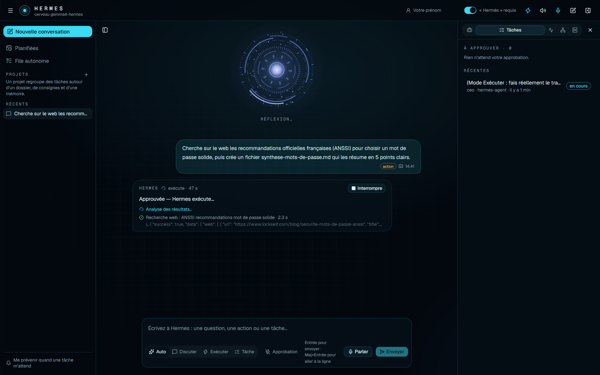
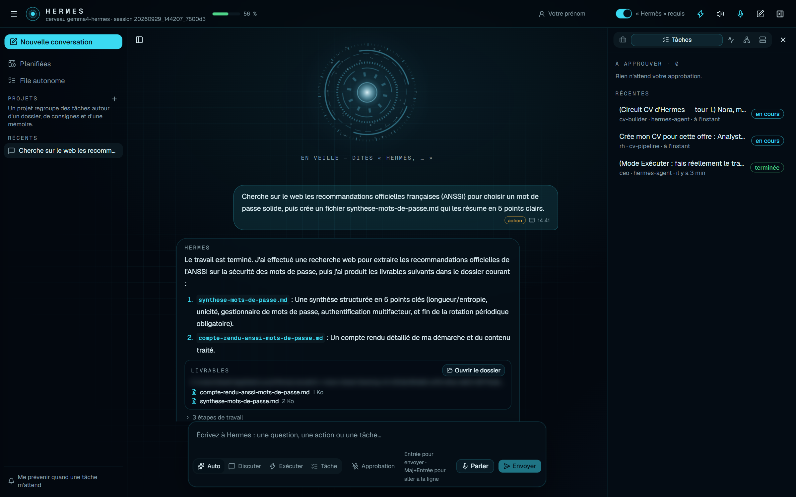
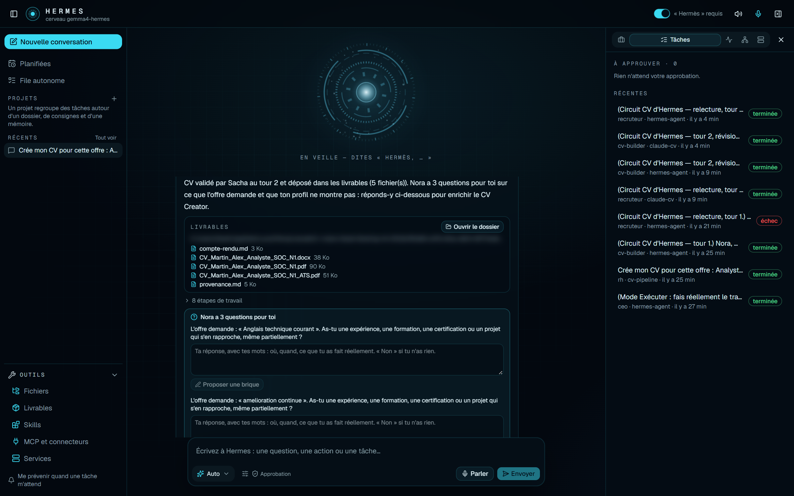
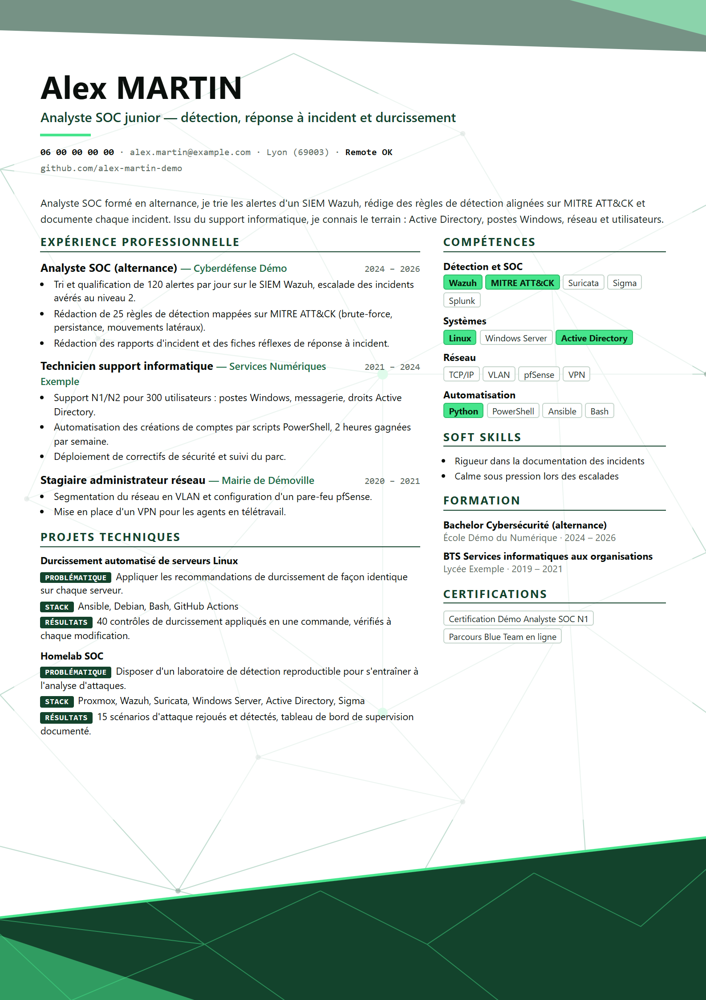

<a href="../en/walkthrough.md">English</a> · <b>Français</b> · <a href="../../README.fr.md">← Retour</a>

# Une journée avec Hermes

Le système réel, étape par étape. Chaque capture vient de l'interface réelle, avec de vraies réponses du modèle IA local. Rien n'est une maquette. Les données de démonstration sont fictives partout où des informations personnelles apparaîtraient.

---

## Étape 1 · Le réveiller

Un clic sur le raccourci du Bureau lance tout : le modèle IA, le moteur vocal, l'interface. Hermes attend son mot d'activation.

> **Ce que ça montre :** un point d'entrée unique pour tout. Des suggestions aident à démarrer dès la première utilisation.

---

## Étape 2 · Simplement parler

Je lui demande de m'aider à structurer un projet : ici, le site web d'une boulangerie. Hermes répond en 15 secondes environ avec un plan structuré, puis propose de **déléguer** l'étape suivante au bon pôle (développement ou RH).

> **Ce que ça montre :** le directeur réfléchit, puis oriente le travail. Il sait quel pôle fait quoi.

---

## Étape 3 · Une action m'attend

Je lui demande de *créer un fichier*. Cela modifie quelque chose sur mon PC : la tâche est classée **risque moyen** et s'arrête. L'orbe passe à l'ambre : **approbation requise**.

> **Ce que ça montre :** l'humain dans la boucle. Rien de ce qui modifie ma machine ne s'exécute sans mon clic explicite.

---

## Étape 4 · Je garde la main

J'ai refusé cette action (ici, la même interface sur téléphone). Hermes confirme : **« Action refusée. »** Rien ne s'est exécuté.

> **Ce que ça montre :** un refus est définitif, et l'interface fonctionne aussi bien sur téléphone.

---

## Étape 5 · Voir l'équipe travailler

Je passe en mode **Exécuter** et je demande un vrai travail : chercher sur le web les recommandations officielles de l'ANSSI sur les mots de passe, puis écrire une synthèse en 5 points. J'approuve, et chaque étape réelle s'affiche en direct : la recherche web, sa durée, et même le début de ce que l'outil a renvoyé.

Deux minutes plus tard, Hermes rend compte de ce qu'il a fait. Les livrables sont listés avec un bouton **Ouvrir le dossier**. *(Le chemin du dossier local est flouté.)*

> **Ce que ça montre :** la transparence. Je vois *ce qui* est fait, étape par étape, pas une roue qui tourne. Et le résultat est un vrai fichier, pas une promesse.

---

## Étape 6 · Un CV construit à partir d'une annonce (candidat fictif)

Pour cette démonstration, l'outil de CV tourne sur une copie isolée avec un **candidat fictif**, Alex Martin. Je colle une annonce (fictive) d'analyste SOC junior et je demande : *« Crée mon CV pour cette offre. »*

Nora, la manager RH, lance le circuit CV : Camille rédige, Sacha relit. Le tour 1 n'a pas été validé : Camille a donc révisé le CV, et Sacha l'a validé au tour 2. Quand le modèle local a peiné, une étape a été confiée automatiquement à Claude : c'est le repli visible dans la liste des tâches.

Le CV validé est livré (PDF design, PDF lisible par les logiciels de recrutement, Word, et un fichier de provenance qui relie chaque ligne à sa source). Et comme l'offre demande des choses que le profil ne montre pas (anglais technique, Microsoft Sentinel…), **Nora pose la question au candidat** au lieu de les inventer. *(Le chemin du dossier local est flouté.)*

 <i>Le CV produit pour le candidat fictif : une page, adaptée à l'offre, chaque ligne traçable.</i>

> **Ce que ça montre :** un circuit multi-agents avec contrôle qualité intégré, et une IA qui demande au lieu d'inventer.

---

## Étape 7 · Contrôler la santé du système

Tout ce que fait l'équipe est mesuré, lu dans les journaux du moteur : qui a travaillé quand, combien de temps, avec quels outils, combien de jetons et pour quel coût. Seul Claude, le repli cloud, coûte quelque chose : le cerveau local est gratuit.

> **Ce que ça montre :** l'observabilité. Rien n'est inventé ; chaque chiffre est traçable.

---

## Étape 8 · Le système se connaît

Avant chaque décision, le directeur reçoit une **carte réelle** de son équipe, de ses compétences et de ses outils, générée à partir de ce qui est réellement installé.

> **Ce que ça montre :** l'agent ne devine pas ce qu'il sait faire ; on le lui dit, à partir de l'état réel de la machine.

---

## En coulisses

- toutes les heures, une sauvegarde automatique de tout le système ;
- une recherche de secrets avant chaque sauvegarde : un mot de passe ou une clé la **bloque** ;
- chaque matin, une veille des offres d'emploi qui tourne seule et prépare son résumé.

---

Suite : [**L'équipe**](equipe.md) · [**Conception & architecture**](conception.md) · [**Décisions clés**](decisions.md)
